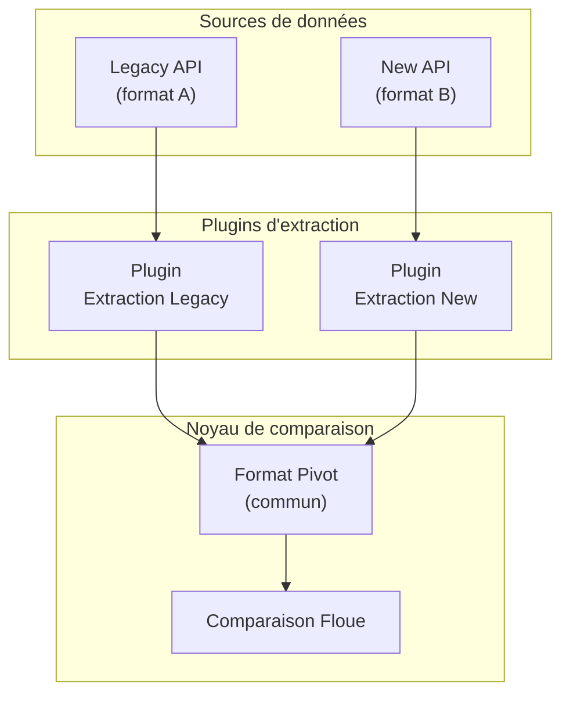
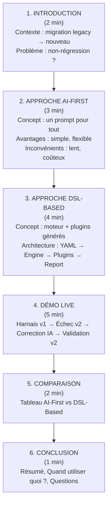

# Requirements - Devoxx France 2026

## Conférence

**Titre** : Tests end-to-end d'API générés par IA : un retour d'expérience en refonte legacy

**Lien** : https://m.devoxx.com/events/devoxxfr2026/talks/91504/tests-endtoend-dapi-gnrs-par-ia-un-retour-dexprience-en-refonte-legacy

**Format** : Conference (45 min)

**Audience** : Développeurs, Architectes, Tech Leads

---

## 1. Objectifs de la Démo

### 1.1 Messages Clés à Transmettre

| # | Message | Importance |
|---|---------|------------|
| 1 | L'IA peut générer et maintenir un harnais de test de non-régression | 🔴 Critique |
| 2 | L'approche DSL-Based est plus efficace que AI-First pour l'industrialisation | 🔴 Critique |
| 3 | L'IA s'adapte automatiquement aux évolutions d'API | 🟡 Important |
| 4 | Le code généré est versionnable, testable et maintenable | 🟡 Important |
| 5 | Cette approche réduit le temps de développement de tests de 80% | 🟢 Nice-to-have |

### 1.2 Ce Qu'il Faut Montrer

- ✅ Un harnais de test fonctionnel qui compare 2 APIs différentes
- ✅ Le harnais détecte un écart de prix (branche `matching-error`)
- ✅ L'échec du harnais suite à une évolution d'API
- ✅ L'IA qui corrige le harnais automatiquement
- ✅ Le harnais corrigé qui fonctionne à nouveau
- ✅ Le harnais détecte un changement de prix après correction (branche `api-evolution-matching-error`)

### 1.3 Résultat Attendu pour l'Audience

À la fin de la présentation, l'audience doit :
- Comprendre la différence entre AI-First et DSL-Based
- Savoir quand utiliser chaque approche
- Avoir une méthode concrète pour appliquer cette technique
- Connaître les avantages et limites de l'approche

---

## 2. Exigences Slides

### 2.1 Concepts à Mettre en Avant

| Concept | Comment le présenter |
|---------|---------------------|
| **Double-run** | Comparer les réponses de 2 APIs sur les mêmes inputs |
| **Format Pivot** | Représentation commune pour comparer des données hétérogènes |
| **Plugin IA** | Code spécifique généré par l'IA pour transformer/comparer |
| **AI-First** | Tout déléguer à l'IA en un seul prompt |
| **DSL-Based** | Moteur déterministe + plugins générés par IA |
| **Évolution API** | Changement de structure/format qui casse le harnais |

#### Format Pivot (Concept Clé)

**Définition** : Normalisation des données sources vers un format commun indépendant des APIs.



**Avantages** :
- Comparaison simplifiée (comparer des pommes avec des pommes)
- Plugin de comparaison indépendant des formats sources
- Seuls les plugins d'extraction à modifier si les APIs évoluent

**Exemple de format pivot** :
```typescript
{
  id: string,      // Identifiant unique
  name: string,    // Nom du produit
  price: number,   // Prix
  stock: number,   // Stock disponible
  // ...autres champs normalisés
}
```

#### Comparaison Floue (Fuzzy Comparison)

**Définition** : Comparaison avec tolérance sur les écarts acceptables.

**Pourquoi c'est important** :
- Les APIs peuvent avoir des différences mineures légitimes
- Évite les faux positifs sur des écarts non significatifs
- Permet de valider l'équivalence fonctionnelle

**Exemples de comparaison floue** :
| Champ | Tolérance | Justification |
|-------|------------|---------------|
| Prix | ±0.01 | Arrondis flottants |
| Stock | Exact | Données critiques |
| Nom | Exact | Identité produit |
| Date | ±1 seconde | Horloges distribuées |

### 2.2 Progression Narrative



### 2.3 Timing par Section

| Section | Durée | Slides | Contenu |
|---------|-------|--------|---------|
| Introduction | 2 min | 2-3 | Contexte, problème |
| AI-First | 3 min | 3-4 | Concept, démo diagramme |
| DSL-Based | 4 min | 4-5 | Architecture, plugins |
| **Démo Live** | **5 min** | 1 | Démonstration pratique |
| Comparaison | 2 min | 1-2 | Tableau comparatif |
| Conclusion | 1 min | 1 | Résumé, questions |

**Total slides estimé** : 12-16 slides

### 2.4 Style Visuel

- **Thème** : Marp avec thème personnalisé `arolla-devoxx.css`
- **Couleurs** : Palette Arolla (bleu foncé #003366, accents)
- **Diagrammes** : Mermaid intégrés
- **Code** : Syntax highlighting, font-size lisible

---

## 3. Exigences Techniques

### 3.1 Prérequis Matériel

| Élément | Exigence | Notes |
|---------|----------|-------|
| Ordinateur | MacBook ou équivalent | 8GB RAM min |
| Écran | Résolution 1080p+ | Pour montrer le code |
| Connectique | HDMI/USB-C | Selon salle |
| Internet | Optionnel | Les mocks fonctionnent offline |

### 3.2 Prérequis Logiciel

```bash
# Versions minimales
Node.js >= 22
npm >= 10
Terminal
```

### 3.3 Environnement de Démo

```bash
# Vérification avant démo
cd /home/openhoat/work/devoxx2026

# Tests E2E sur main
git checkout main
npm run test:e2e:step-by-step
# Attendu : tests passent ✅

# Bascule entre les branches de démo
git checkout matching-error      # Écart de prix ❌
git checkout api-evolution       # Évolution API v2 ❌
git checkout api-evolution-fix   # Harnais corrigé ✅
git checkout api-evolution-matching-error  # Changement de prix v2 ❌
```

### 3.4 Points de Risque

| Risque | Probabilité | Mitigation |
|--------|-------------|------------|
| Tests ne passent pas | Faible | Vérifier 5 min avant |
| Terminal illisible | Moyenne | Font size 18+ |
| Temps insuffisant | Moyenne | Avoir une version courte |
| Oubli du scénario | Faible | Lire `doc/demo-script.md` |

---

## 4. Checklist Avant Conférence

### J-7

- [ ] Vérifier les tests : `npm run test:e2e:step-by-step`
- [ ] Vérifier les 5 branches Git de la démo
- [ ] Relire les slides
- [ ] Répéter la démo (chronométrer)

### J-1

- [ ] Tester la présentation Marp : `npm run slides:build`
- [ ] Vérifier les mocks v1 et v2
- [ ] Préparer les backups (screenshots si démo échoue)

### Le Jour J (avant)

- [ ] Arriver 15 min avant
- [ ] Vérifier connectique
- [ ] Lancer votre éditeur et le terminal
- [ ] Exécuter `npm run test:e2e:step-by-step` (validation)
- [ ] Positionner sur `main` : `git checkout main`

---

## 5. Checklist Pendant la Démo

### Étape 1 : État Initial (branche `main`)

- [ ] Annoncer "Passons à la démo"
- [ ] Montrer le terminal
- [ ] `git checkout main`
- [ ] Exécuter `npm run test:e2e:step-by-step`
- [ ] Montrer que les tests passent ✅

### Étape 2 : Erreur de Prix (branche `matching-error`)

- [ ] Dire "Voyons si le harnais détecte les erreurs de prix"
- [ ] `git checkout matching-error`
- [ ] Exécuter `npm run test:e2e:step-by-step`
- [ ] Montrer l'erreur de prix ❌

### Étape 3 : Évolution API v2 (branche `api-evolution`)

- [ ] Dire "Simulons une évolution d'API"
- [ ] `git checkout api-evolution`
- [ ] Exécuter `npm run test:e2e:step-by-step`
- [ ] Montrer l'erreur de format ❌

### Étape 4 : Correction IA (branche `api-evolution-fix`)

- [ ] Dire "L'IA a corrigé les plugins"
- [ ] Montrer les commits de correction : `git log api-evolution..api-evolution-fix --oneline`
- [ ] `git checkout api-evolution-fix`
- [ ] Exécuter `npm run test:e2e:step-by-step`
- [ ] Montrer que les tests passent ✅

### Étape 5 : Changement de Prix v2 (branche `api-evolution-matching-error`)

- [ ] Dire "Le harnais détecte aussi les changements de prix"
- [ ] `git checkout api-evolution-matching-error`
- [ ] Exécuter `npm run test:e2e:step-by-step`
- [ ] Montrer l'erreur de prix ❌

---

## 6. Documents de Référence

| Document | Emplacement | Usage |
|----------|-------------|-------|
| Script de démo | `doc/demo-script.md` | Chronologie à suivre |
| Détails techniques | `doc/demo-details.md` | Architecture, prompts |
| Workflow IA | `prompts/.../products-to-offers/workflows/` | Workflows de correction |
| Slides | `slides/presentation.md` | Présentation Marp |

---

*Dernière mise à jour : 18/04/2026*
