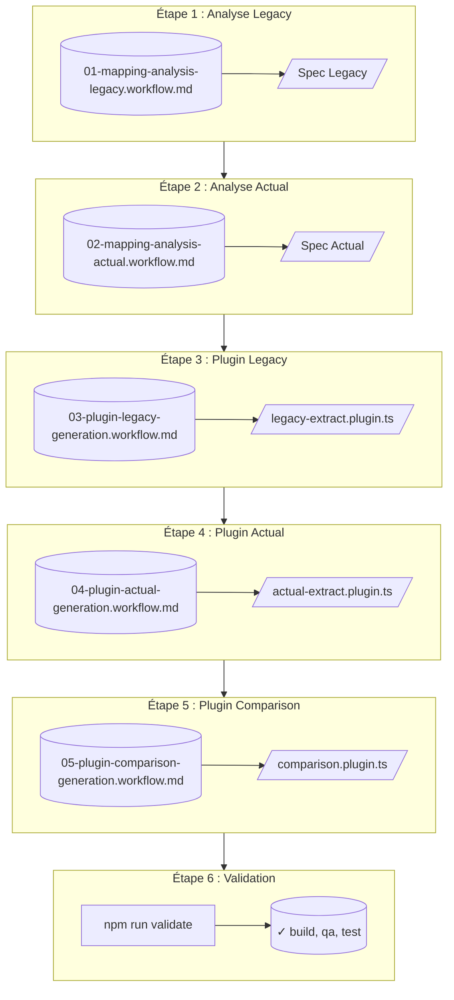

# Workflow d'Évolution d'API - Guide Étape par Étape

## Objectif

Ce guide décrit le processus complet pour corriger un harnais de test suite à une évolution d'API. Il est conçu pour être utilisé lors d'une démonstration.

---

## Vue d'ensemble du flux



---

## Étape 1 : Analyse des données Legacy

### 🎯 Objectif

L'IA analyse les mocks Legacy pour découvrir automatiquement les chemins JSONPath.

### 📁 Fichier à exécuter

```
prompts/usecases/products-to-offers/workflows/01-mapping-analysis-legacy.workflow.md
```

### 📥 Entrée

Mocks dans :

```
mocks/sequences/products-to-offers-comparison/*-legacy-*.json
```

### 📤 Sortie

Spécification générée :

```
prompts/usecases/products-to-offers/specs/legacy-extract-analysis.spec.md
```

### ✅ Résultat attendu

La spec contient :

- Les chemins JSONPath pour chaque champ
- Les règles de transformation
- Les cas particuliers

---

## Étape 2 : Analyse des données Actual

### 🎯 Objectif

L'IA analyse les mocks Actual pour découvrir automatiquement les chemins JSONPath.

### 📁 Fichier à exécuter

```
prompts/usecases/products-to-offers/workflows/02-mapping-analysis-actual.workflow.md
```

### 📥 Entrée

Mocks dans :

```
mocks/sequences/products-to-offers-comparison/*-actual-*.json
```

### 📤 Sortie

Spécification générée :

```
prompts/usecases/products-to-offers/specs/actual-extract-analysis.spec.md
```

### ✅ Résultat attendu

La spec contient :

- Les chemins JSONPath pour chaque champ
- Les règles de transformation
- Les cas particuliers

---

## Étape 3 : Génération du plugin Legacy

### 🎯 Objectif

Générer le plugin d'extraction des données Legacy.

### 📁 Fichier à exécuter

```
prompts/usecases/products-to-offers/workflows/03-plugin-legacy-generation.workflow.md
```

### 📥 Entrées

- `specs/legacy-extract-analysis.spec.md` : Mappings JSONPath
- `specs/pivot-format.spec.md` : Format Pivot cible

### 📤 Sortie

Plugin généré :

```
src/test/e2e/plugins/legacy-extract.plugin.ts
```

### 🔧 Validation

```bash
npm run build
```

---

## Étape 4 : Génération du plugin Actual

### 🎯 Objectif

Générer le plugin d'extraction des données Actual.

### 📁 Fichier à exécuter

```
prompts/usecases/products-to-offers/workflows/04-plugin-actual-generation.workflow.md
```

### 📥 Entrées

- `specs/actual-extract-analysis.spec.md` : Mappings JSONPath
- `specs/pivot-format.spec.md` : Format Pivot cible

### 📤 Sortie

Plugin généré :

```
src/test/e2e/plugins/actual-extract.plugin.ts
```

### 🔧 Validation

```bash
npm run build
```

---

## Étape 5 : Génération du plugin Comparison

### 🎯 Objectif

Générer le plugin de comparaison entre Legacy et Actual.

### 📁 Fichier à exécuter

```
prompts/usecases/products-to-offers/workflows/05-plugin-comparison-generation.workflow.md
```

### 📥 Entrées

- `specs/pivot-format.spec.md` : Format Pivot
- `specs/comparison-analysis.spec.md` : Règles de comparaison

### 📤 Sortie

Plugin généré :

```
src/test/e2e/plugins/comparison.plugin.ts
```

### 🔧 Validation

```bash
npm run build
```

---

## Étape 6 : Validation finale

### 🎯 Objectif

Valider que tout fonctionne : compilation, linting, tests.

### 🔧 Commande

```bash
npm run validate
```

### ✅ Résultat attendu

```
✓ build
✓ qa
✓ test
```

---

## Fichiers de référence

| Type | Fichier | Rôle |
|------|---------|------|
| **Workflows** |||
| Analyse Legacy | `workflows/01-mapping-analysis-legacy.workflow.md` | Lance l'analyse IA |
| Analyse Actual | `workflows/02-mapping-analysis-actual.workflow.md` | Lance l'analyse IA |
| Génération Legacy | `workflows/03-plugin-legacy-generation.workflow.md` | Génère plugin Legacy |
| Génération Actual | `workflows/04-plugin-actual-generation.workflow.md` | Génère plugin Actual |
| Génération Comparison | `workflows/05-plugin-comparison-generation.workflow.md` | Génère plugin Comparison |
| **Spécifications** |||
| Spec Legacy | `specs/legacy-extract-analysis.spec.md` | Mapping JSONPath Legacy |
| Spec Actual | `specs/actual-extract-analysis.spec.md` | Mapping JSONPath Actual |
| Spec Pivot | `specs/pivot-format.spec.md` | Format commun (manuel) |
| Spec Comparison | `specs/comparison-analysis.spec.md` | Règles de comparaison |
| **Templates** |||
| Plugin generation | `templates/plugin-generation.template.md` | Template de génération |

---

## Notes importantes

### Pivot Format (manuel)

Le fichier `specs/pivot-format.spec.md` est **manuel**. Il définit le format commun vers lequel les données sont transformées. Si une nouvelle donnée apparaît dans les APIs :

1. L'IA identifie le nouveau champ
2. L'humain décide s'il doit être ajouté au pivot
3. Le fichier est mis à jour manuellement

### Comparison Spec (manuel)

Le fichier `specs/comparison-analysis.spec.md` est **manuel**. Il définit les règles de comparaison :

- Égalité stricte ou tolérance
- Normalisation des valeurs
- Gestion des cas particuliers

---

## Scénario de démonstration

```bash
# 1. Basculer sur la branche api-evolution
git checkout api-evolution

# 2. Vérifier que les tests échouent
npm run test:e2e:mock

# 3. Exécuter l'analyse Legacy (via IA)
# Ouvrir: prompts/usecases/products-to-offers/workflows/01-mapping-analysis-legacy.workflow.md

# 4. Exécuter l'analyse Actual (via IA)
# Ouvrir: prompts/usecases/products-to-offers/workflows/02-mapping-analysis-actual.workflow.md

# 5. Générer le plugin Legacy (via IA)
# Ouvrir: prompts/usecases/products-to-offers/workflows/03-plugin-legacy-generation.workflow.md

# 6. Générer le plugin Actual (via IA)
# Ouvrir: prompts/usecases/products-to-offers/workflows/04-plugin-actual-generation.workflow.md

# 7. Générer le plugin Comparison (via IA)
# Ouvrir: prompts/usecases/products-to-offers/workflows/05-plugin-comparison-generation.workflow.md

# 8. Valider que tout fonctionne
npm run validate

# 9. Vérifier que les tests passent
npm run test:e2e:mock
