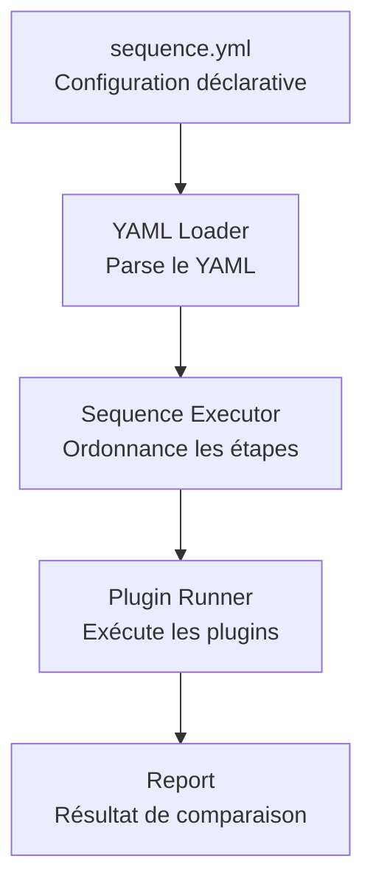
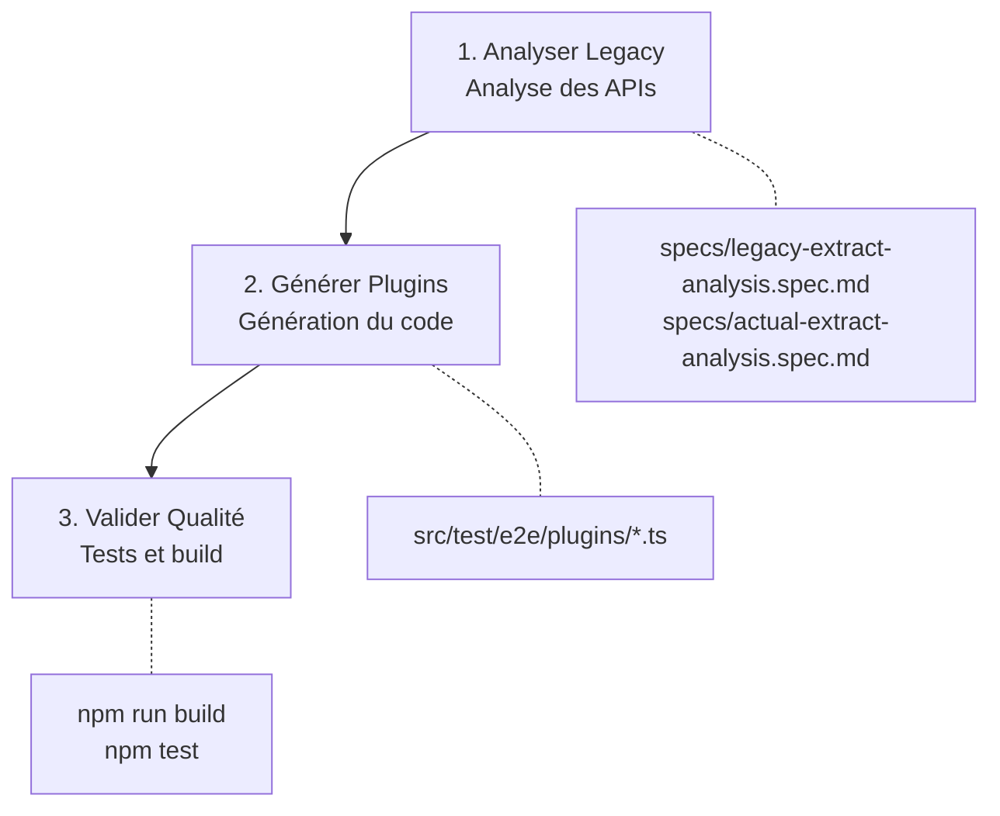
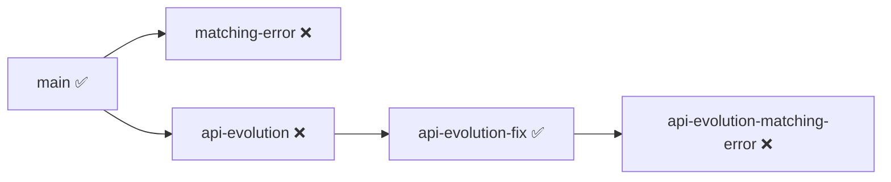

# Détails Techniques de la Démo

## Vue d'ensemble

Ce document détaille tous les aspects techniques de la démonstration Devoxx 2026 : architecture, prompts, workflows, et mise en œuvre concrète.

---

## 1. Architecture du Harnais de Test

### 1.1 Moteur de Séquence HTTP

Le cœur du système est un **moteur de séquence déterministe** qui exécute des requêtes HTTP selon une configuration YAML.



### 1.2 Fichier de Séquence YAML

**Chemin :** `src/test/e2e/products-to-offers.sequence.yml`

```yaml
name: "Products to Offers Comparison"
description: "Compare legacy product API with new offers API"

steps:
  # Step 1: Get legacy products
  - name: legacy-products
    request:
      method: GET
      endpoint: "{{legacyBaseUrl}}/api/v1/products"
    plugins:
      - name: Extract legacy products
        type: legacyExtractPlugin

  # Step 2: Get new offers
  - name: actual-offers
    request:
      method: POST
      endpoint: "{{actualBaseUrl}}/api/v2/offers/search"
    plugins:
      - name: Extract actual offers
        type: actualExtractPlugin

  # Step 3: Compare data
  - name: comparison
    plugins:
      - name: Compare products vs offers
        type: productOfferComparisonPlugin
```

### 1.3 Système de Plugins

Les plugins sont des fonctions TypeScript qui transforment ou comparent les données.

**Chemin :** `src/test/e2e/plugins/comparison.plugin.ts`

```typescript
// Structure d'un plugin
export type Plugin = (
  context: { store: JsonRecord; logger: Logger },
  ...args: unknown[]
) => void

// Exemple : Plugin d'extraction Legacy
export const legacyExtractPlugin: Plugin = ({ store, logger }): void => {
  logger.info('📦 Extracting legacy products...')
  
  // 1. Extraire les données de la conversation
  const data = JSONPath({ path: '$.conversation.legacy-products.response.data', json: store })
  
  // 2. Transformer en format pivot
  const normalizedProducts = data.products.map(p => ({
    id: String(p.id),
    name: String(p.name),
    price: Number(p.price),
    stock: Number(p.stock)
  }))
  
  // 3. Stocker dans le state
  store.state.legacyProducts = normalizedProducts
  
  logger.info(`✅ Extracted ${normalizedProducts.length} products`)
}
```

---

## 2. Domaine de Démonstration : E-commerce

### 2.1 APIs Comparées

| API | Endpoint | Méthode |
|-----|----------|---------|
| **Legacy** | `/api/v1/products` | GET |
| **New** | `/api/v2/offers/search` | POST |

### 2.2 Mapping des Champs

| Legacy Format | New Format | Transformation |
|---------------|------------|-----------------|
| `product.id` | `offer.productId` | `String()` |
| `product.name` | `offer.title` | `String()` |
| `product.price` | `offer.pricing.total` | `Number()` |
| `product.stock` | `offer.availability.quantity` | `Number()` |
| `product.attributes` | `offer.attributes[]` | Objet → Tableau |

### 2.3 Format Pivot

Le format pivot est la représentation commune pour la comparaison :

```typescript
type ProductPivot = {
  id: string
  name: string
  price: number
  stock: number
  category: string
  currency: string
  attributes: Record<string, unknown>
}
```

**Spécification complète :** `prompts/usecases/products-to-offers/specs/pivot-format.spec.md`

---

## 3. Prompts et Workflows IA

### 3.1 Approche AI-First

**Principe :** Un seul prompt pour tout gérer.

**Fichier :** `prompts/usecases/products-to-offers/workflows/ai-first-full.workflow.md`

**Comment l'utiliser :**

```bash
# Dans Cline (ou autre agent IA), copier le contenu du workflow
# comme prompt initial

cat prompts/usecases/products-to-offers/workflows/ai-first-full.workflow.md
```

**Contenu du prompt (extrait) :**

```markdown
# Workflow AI-First : Analyse complète Legacy vs Actual

## Objectif
Réaliser l'analyse complète des APIs Legacy et Actual en un seul prompt IA.

## Contexte
- Tu es un expert en analyse d'API et comparaison de données JSON.
- Tu sais utiliser JSONPath pour extraire des données de documents JSON.

## Configuration
**Cas de test** : Utiliser le paramètre `testCaseIndex` pour sélectionner le cas.

## Étapes
1. Charger les données Legacy
2. Charger les données Actual
3. Comparer les données
4. Produire le rapport
```

### 3.2 Approche DSL-Based

**Principe :** Générer les plugins avec l'IA, exécuter avec le moteur.

**Fichier :** `prompts/usecases/products-to-offers/workflows/plugin-generation.workflow.md`

**Comment l'utiliser :**

1. **Analyser les APIs** avec le prompt d'analyse
2. **Générer les plugins** avec le prompt de génération
3. **Valider** avec le prompt de qualité

**Workflow complet :**



### 3.3 Spécifications d'Extraction

**Legacy Extract :** `prompts/usecases/products-to-offers/specs/legacy-extract-analysis.spec.md`

Ce fichier définit :

- Le format de réponse de l'API Legacy
- Les règles JSONPath d'extraction
- Les transformations à appliquer
- La gestion des erreurs

**Actual Extract :** `prompts/usecases/products-to-offers/specs/actual-extract-analysis.spec.md`

Ce fichier définit :

- Le format de réponse de l'API New
- La conversion des attributs (tableau → objet)
- Les règles de mapping

### 3.4 Algorithme de Comparaison

**Fichier :** `prompts/usecases/products-to-offers/specs/comparison-analysis.spec.md`

**Logique de comparaison :**

```typescript
const compareProducts = (legacy: ProductPivot[], actual: ProductPivot[]) => {
  const result = {
    matched: true,
    missingInActual: [],
    extraInActual: [],
    mismatches: []
  }

  // 1. Vérifier chaque produit Legacy existe dans Actual
  for (const product of legacy) {
    const offer = actual.find(o => o.id === product.id)
    if (!offer) {
      result.missingInActual.push(product.id)
      result.matched = false
      continue
    }
    
    // 2. Comparer les champs
    if (product.name !== offer.name) {
      result.mismatches.push({ field: 'name', legacy: product.name, actual: offer.name })
      result.matched = false
    }
    
    if (Math.abs(product.price - offer.price) > 0.01) {
      result.mismatches.push({ field: 'price', legacy: product.price, actual: offer.price })
      result.matched = false
    }
  }

  return result
}
```

---

## 4. Mise en Œuvre Concrète

### 4.1 Prérequis

```bash
# Node.js 22+
node --version

# Cloner le projet
cd /home/openhoat/work/devoxx2026

# Installer les dépendances
npm install
```

### 4.2 Lancer les Tests

```bash
# Tests E2E avec mocks
npm run test:e2e:mock

# Tests E2E pas à pas
npm run test:e2e:step-by-step

# Tests avec logs détaillés
LOG_LEVEL=debug npm run test:e2e:mock
```

### 4.3 Structure des Mocks

```
mocks/sequences/products-to-offers-comparison/
├── 01-step-01-legacy-products-*.json  ← Cas 1 : Legacy
├── 01-step-02-actual-offers-*.json    ← Cas 1 : Actual (match)
├── 02-step-01-legacy-products-*.json  ← Cas 2 : Legacy
├── 02-step-02-actual-offers-*.json    ← Cas 2 : Actual (prix différent)
├── 03-step-01-legacy-products-*.json  ← Cas 3 : Legacy
└── 03-step-02-actual-offers-*.json    ← Cas 3 : Actual (produit manquant)
```

**Nommeage des fichiers :**

- `XX-step-YY-name-hash.json`
- `XX` = numéro du cas de test (01, 02, 03)
- `YY` = numéro de l'étape (01, 02)
- `name` = nom de l'étape (legacy-products, actual-offers)
- `hash` = hash unique pour le mock

### 4.4 Créer un Nouveau Cas de Test

1. **Créer les mocks** : Ajouter les fichiers JSON dans `mocks/sequences/products-to-offers-comparison/`

2. **Modifier le test** : Ajouter un test dans `src/test/e2e/products-to-offers.e2e.test.ts`

```typescript
test('should detect new test case', async () => {
  const result = await executeSequence(sequence, {
    plugins,
    parameters,
    testCaseIndex: 4,  // Nouveau cas
  })
  
  // Assertions...
})
```

### 4.5 Générer de Nouveaux Plugins avec l'IA

**Étape 1 :** Ouvrir Cline (ou autre agent IA)

**Étape 2 :** Utiliser le prompt de génération

```
Je veux générer des plugins pour comparer les APIs suivantes :

API Legacy : [décrire le format]
API New : [décrire le format]

Utilise le workflow : prompts/usecases/products-to-offers/workflows/plugin-generation.workflow.md
```

**Étape 3 :** Valider le code généré

```bash
npm run build
npm test
```

---

## 5. Exemples de Sorties

### 5.1 Cas Nominal (Match)

```json
{
  "comparisonResult": {
    "matched": true,
    "totalProducts": 3,
    "totalOffers": 3,
    "matchedItems": [
      { "legacyId": "P001", "priceMatch": true, "stockMatch": true, "nameMatch": true },
      { "legacyId": "P002", "priceMatch": true, "stockMatch": true, "nameMatch": true },
      { "legacyId": "P003", "priceMatch": true, "stockMatch": true, "nameMatch": true }
    ],
    "missingInActual": [],
    "mismatches": []
  }
}
```

### 5.2 Cas avec Écart de Prix

```json
{
  "comparisonResult": {
    "matched": false,
    "mismatches": [
      {
        "field": "products[P001].price",
        "legacyValue": 1299.99,
        "actualValue": 1349.99
      }
    ]
  }
}
```

### 5.3 Cas avec Produit Manquant

```json
{
  "comparisonResult": {
    "matched": false,
    "missingInActual": ["P003"],
    "totalProducts": 3,
    "totalOffers": 2
  }
}
```

---

## 6. Fichiers Clés

| Fichier | Rôle |
|---------|------|
| `src/main/http-sequencer/sequence-executor.ts` | Moteur d'exécution |
| `src/main/http-sequencer/mock-manager.ts` | Gestion des mocks |
| `src/test/e2e/plugins/comparison.plugin.ts` | Plugin de comparaison |
| `prompts/usecases/products-to-offers/specs/*.md` | Spécifications |
| `prompts/usecases/products-to-offers/workflows/*.md` | Workflows IA |

---

## 7. Branches Git de la Démo

Le déroulé de la démo utilise 5 branches Git pour illustrer les différents scénarios :

| Branche | État | Scénario |
|---------|------|----------|
| `main` | ✅ Tests passent | État initial — harnais de test fonctionnel sur APIs v1 |
| `matching-error` | ❌ Tests échouent | Écart de prix détecté — les mocks v1 ont un prix différent |
| `api-evolution` | ❌ Tests échouent | Évolution API v2 — le format des réponses a changé |
| `api-evolution-fix` | ✅ Tests passent | Plugins corrigés par IA — le harnais fonctionne à nouveau |
| `api-evolution-matching-error` | ❌ Tests échouent | Changement de prix en v2 — détection d'erreur métier |



---

## 8. Commandes Utiles

```bash
# Build
npm run build

# Tests E2E avec mocks
npm run test:e2e:mock

# Tests E2E pas à pas
npm run test:e2e:step-by-step

# Logs debug
LOG_LEVEL=debug npm run test:e2e:mock

# Voir les mocks
ls mocks/sequences/products-to-offers-comparison/

# Ouvrir les plugins
code src/test/e2e/plugins/comparison.plugin.ts
