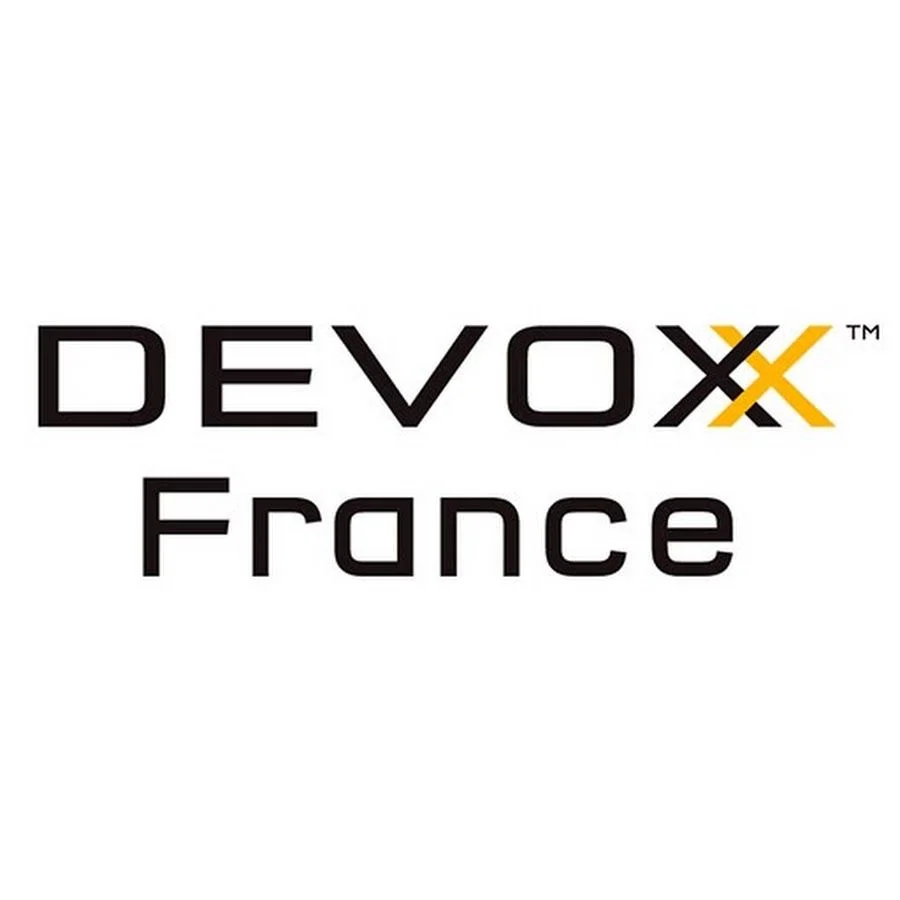
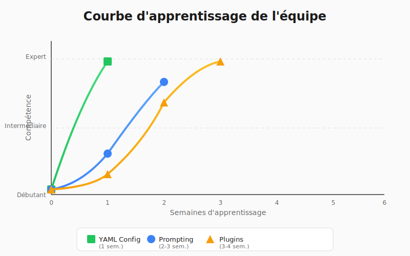

<!-- _class: title -->
<!-- _footer: "" -->

# Tests e2e d'API générés par IA

<br>

## Un retour d'expérience en refonte legacy

<div class="logos">
  
  
</div>

<em>23/04/2026</em>

---

<!-- _class: transition -->

## 🎯 Le constat


Les tests de non-régression, un défi majeur en refonte legacy.

---

## 🔧 Le problème : refonte legacy et tests de non-régression

Comment s'assurer que la nouvelle API produit les mêmes résultats que l'ancienne ?

- **API legacy** : API historique utilisée depuis des années
- **API actual (nouvelle)** : Nouvelle implémentation avec architecture moderne
- **Contexte** : API massive et fortement exposée, migration longue 
- **Objectif** : Migrer sans casser les fonctionnalités existantes

---

## 🔄 Le défi du <span class="highlight">double run testing</span>

Principe simple : comparer les réponses des deux API

[](assets/diagrams/double-run.svg)

---

## 😰 Pourquoi c'est difficile

<div class="columns">
<div>

**Différences de structure JSON**

| Legacy API      | New API                       |
|-----------------|-------------------------------|
| `product.id`    | `offer.productId`             |
| `product.name`  | `offer.title`                 |
| `product.price` | `offer.pricing.total`         |
| `product.stock` | `offer.availability.quantity` |

</div>
<div>

**Problèmes rencontrés :**

- Nommage des champs différent
- Structures imbriquées différentes
- Réponses JSON de 200KB+
- Champs optionnels vs obligatoires
- Payloads différents
- Enchaînements de requêtes parfois différents

</div>
</div>

---

## 🧠 L'opportunité <span class="highlight">IA</span> : comprendre le sens

**L'avantage de l'IA : comprendre le sens, pas seulement la structure**

- Comprendre que `product.name` équivaut à `offer.title`
- Mapper automatiquement les champs équivalents
- Détecter les incohérences sémantiques
- Générer du code de transformation

---

<!-- _class: transition -->

## 🧭 L'exploration


Une quête pour trouver la bonne approche.

---

## 🧭 Notre parcours d'exploration

**Outils explorés :**

- **LLM** : Claude sonnet / opus, Gemini flash / pro, GLM, Qwen coder
- **RAG** : Preuve de concept sur une base de connaissances
- **MCP** : Model Context Protocol pour l'intégration d'outils
- **Playwright** : Automatisation de tests e2e
- **LangChain** : Workflows IA en TypeScript

<br>

**Convergence vers une solution hybride**

---

## 🛠️ Stack technique retenue

| Composant     | Solution          | Rôle                                      |
|---------------|-------------------|-------------------------------------------|
| Agent         | Cline             | Orchestration des workflows de génération |
| LLM           | Claude Sonnet 4   | Génération de code et analyse             |
| Langage       | TypeScript / Jest | Framework et tests                        |
| Configuration | YAML              | DSL déclaratif                            |
| Protocole     | MCP               | Intégration avec les APIs                 |

---

## 🤖 Architecture AI-First : concept

**Un seul prompt pour tout gérer**

[](assets/diagrams/ai-first-architecture.svg)

---

## Architecture AI-First : fonctionnement

Tâches accomplies par l'IA :

1. **Appel API** : utilise un outil MCP pour consommer les APIs
2. **Analyse** : compare les structures JSON
3. **Mapping** : identifie les correspondances de champs
4. **Rapport** : génère un rapport de comparaison

---

## Architecture AI-First : bilan

| ✅ Avantages                 | ❌ Inconvénients                                        |
|-----------------------------|--------------------------------------------------------|
| Un seul prompt complet      | Taille et complexité du prompt                         |
| Simplicité de mise en œuvre | Un appel IA par test (coût)                            |
| Aucun code à maintenir      | Exécution manuelle nécessaire (interaction inévitable) |
| Compréhension sémantique    | Fiabilité non garantie                                 |

<br>

**👉 Bon pour l'exploration, pas pour l'industrialisation**

---

<!-- _class: transition -->

## ⚙️ La solution


Une architecture DSL-Based.

---

## ⚙️ Architecture <span class="highlight">DSL-Based</span> : concept

**Moteur déterministe + plugins générés par IA**

<br>

[](assets/diagrams/dsl-based-architecture.svg)

---

## Architecture DSL-Based : fonctionnement

**Deux phases :**

1. **Phase de développement : l'IA**
   - Analyse les APIs (legacy et actual)
   - Génère les plugins de transformation
   - Génère les assertions de comparaison

2. **Phase d'exécution (déterministe) : le moteur**
   - Lit la configuration YAML
   - Exécute les requêtes HTTP
   - Applique les plugins
   - Produit le rapport

---

## Le moteur de séquence YAML

<div class="columns">
<div>
<small>

```yaml
name: "Products to Offers Comparison"
steps:
  - name: legacy-products
    request:
      method: GET
      endpoint: "{{legacyBaseUrl}}/api/v1/products"
      headers:
        Accept: "application/json"
        X-Client-Id: "demo-client"
    plugins:
      - name: Extract legacy products
        type: legacyExtractPlugin
```

</small>
</div>
<div>
<small>

```yaml
  - name: actual-offers
    request:
      method: POST
      endpoint: "{{actualBaseUrl}}/api/v2/offers/search"
      headers:
        Content-Type: "application/json"
      payload:
        query:
          type: "product_search"
          filters:
            category: "all"
    plugins:
      - name: Extract actual offers
        type: actualExtractPlugin

  - name: comparison
    plugins:
      - name: Compare products vs offers
        type: productOfferComparisonPlugin
```

</small>
</div>
</div>

---

## Système de plugins

**Types de plugins :**

| Type        | Rôle                    | Exemple                        |
|-------------|-------------------------|--------------------------------|
| Extraction  | Transformer les données | `legacyExtractPlugin`          |
| Assertion   | Vérifier des valeurs    | `equalPlugin`                  |
| Comparaison | Comparer deux formats   | `productOfferComparisonPlugin` |

<br>

**Génération par IA :**
- Analyse les formats JSON
- Génère le code TypeScript du plugin
- Le plugin est intégré au moteur

---

## 🔄 Un format <span class="highlight">pivot</span>

**Un format commun pour comparer deux structures différentes**

| API legacy      | Format pivot | API actual                    |
|-----------------|--------------|-------------------------------|
| `product.id`    | → `id`       | `offer.productId`             |
| `product.name`  | → `name`     | `offer.title`                 |
| `product.price` | → `price`    | `offer.pricing.total`         |
| `product.stock` | → `stock`    | `offer.availability.quantity` |

<br>

Chaque plugin d'extraction transforme les données vers ce format commun

> 💡 *Contrat métier piloté par l'humain (→ « j'ai besoin de la catégorie maintenant »)*

---

## 📋 Architecture déléguée

**Workflow de génération en 6 étapes**

[](assets/diagrams/workflow-6-steps.svg)

<br>

**Avantage : validation par étape, contexte maîtrisé par tâche**

> 💡 *6 workflows spécialisés et / ou un workflow qui orchestre le tout*

---

<!-- _class: transition -->


## 🎬 Démo

- Workflow de génération de plugins
- Comparaison API legacy vs actual
- Utilisation du harnais de tests

---

<!-- _class: transition -->

## 💡 Concepts émergents


*Réflexions suite à l'expérience…*

---

## ✂️ Les bienfaits du <span class="highlight">découpage</span>

- ✅ Réduction de la complexité cognitive
- ✅ Validation progressive (fail fast)
- ✅ Reproductibilité des résultats
- ✅ Traçabilité et auditabilité
- ✅ Maintenance facilitée (scope limité)
- ✅ Fenêtre de contexte sous contrôle (évite ralentissements, hallucinations et plantages)
- ✅ Coût IA maîtrisé (contextes réduits = moins de retries et de gaspillage)

> 💡 *Chaque étape = un contrat vérifiable*
>
> 💡 *Temps passé à découper = investissement qui change la donne*

---

## 💡 IA et déterminisme : une question de <span class="highlight">temporalité</span>

- L'IA n'est pas déterministe par nature
- Mais une fois validée par un process fiable, le résultat devient déterministe
- Combien de fois invoque-t-on l'IA dans un cycle ?
- Et si ce que produit l'IA est contrôlé par quelque chose de stable ?
- Que se passe-t-il si le contrôle est lui-même généré par IA ?

<br>

**→ Question de cycle / temporalité :**

- Le processus de contrôle se doit toujours d'être plus stable que le sujet du contrôle
- Peu importe qu'il émane d'un humain ou d'une IA, c'est la **confiance accumulée** qui compte

---

## 🎵 L'analogie du Jazz : <span class="highlight">la pulsation</span>

**En musique Jazz, l'improvisation repose sur un fondement solide :**

**Pulsation** (beat, colonne vertébrale), harmonie (contexte), improvisation (liberté).

> « L'improvisation, c'est la liberté surveillée ! »
> 
> <span class="author">— Didier Court (guitariste jazz)</span>

| Jazz          | Projet IA                 |
|---------------|---------------------------|
| Pulsation     | Checkpoints du workflow   |
| Accords       | Spécifications et formats |
| Improvisation | Tâches de génération      |

---

## <span class="highlight">Vibe-coding</span> : improviser sans cadre

**Laisser l'IA improviser sans structure définie :**

- ❌ Résultats imprévisibles
- ❌ Difficile à reproduire
- ❌ Pas de traçabilité
- ❌ Risque d'hallucination

**Le risque :** L'IA génère du code sans validation

---

## <span class="highlight">Pulse-coding</span> : cadre structuré avec checkpoints

**Un cadre structuré avec des points de validation :**

- ✅ Validation à chaque étape
- ✅ Reproductibilité garantie
- ✅ Traçabilité via Git
- ✅ Erreurs détectées tôt

> 💡 La pulse : point de synchro non arbitrable qui cadence et jugule l'improvisation

---

## Bilan

<div class="columns">
<div>

**✅ Ce qui a fonctionné**

**Architecture DSL-Based :**
- Exécution rapide (1-2 secondes)
- Tests reproductibles
- Coût minimal à l'exécution
- Intégration CI/CD facile

<br>

**Génération IA des plugins :**
- Mapping automatique des champs
- Qualité du code : AAAA 
- Maintenance facilitée

</div>
<div>

**❌ Ce qui n'a pas fonctionné**

**Architecture AI-First :**
- Trop lent pour les tests quotidiens
- Résultats parfois inconsistants
- Coût élevé pour beaucoup de tests

<br>

**Défis généraux :**
- Accès aux APIs de production délicat
- Gestion des environnements / données de test
- Budget IA qui explose sur des grosses sessions

</div>
</div>

---

## 🧩 Les défis techniques rencontrés

1. **JSON volumineux (200KB+)**
   - Solution : extraction JSONPath avant envoi à l'IA

2. **Compréhension du métier**
   - Solution : prompts avec exemples et contexte

3. **Double appel API**
   - Solution : mocks pour les tests reproductibles

4. **Instabilités**
   - Risque d'hallucination avec des modèles moins capables
   - Solution : mieux découper

---

## Gestion des JSON volumineux

**Problème :** Fichiers de réponse de 200KB+ → fenêtre de contexte saturée

**Solution : L'IA utilise le MCP `json-tools` pour interroger le JSON via JSONPath**

<div class="columns">
<div>

❌ **Sans MCP**

L'IA reçoit tout le JSON dans son contexte

```json
// mock.json → 200KB+ en contexte
{ "products": [ ...500 items... ] }
```

</div>
<div>

✅ **Avec MCP `json-tools`**

L'IA interroge uniquement ce dont elle a besoin

```
json_query("$.products[0]")
→ { "id": "P001", "name": "Cable HDMI",
    "price": 12.99, "stock": 42 }

json_query("$.products[*].price")
→ [12.99, 24.99, 8.50, ...]
```

</div>
</div>

**Bénéfice :** L'IA comprend la structure sans jamais charger la collection entière

---

## Coûts et performance comparés

| Métrique              | AI-First     | DSL-Based    |
|-----------------------|--------------|--------------|
| Temps par test        | 5-12 minutes | 1-2 secondes |
| Coût de mise en œuvre | 0            | ~$2          |
| Coût par test         | $4-12        | 0            |
| Reproductibilité      | Variable     | 100%         |
| Maintenance prompts   | Élevée       | Faible       |
| Intégration CI/CD     | Difficile    | Facile       |

**ROI :** DSL-Based payant après quelques tests

---

## 📊 KPI IA (Claude Sonnet)

**5 étapes, ~15 minutes, ~$2 au total**

| Étape     | Rôle              | Tokens   | Coût    | Durée       |
|-----------|-------------------|----------|---------|-------------|
| 1         | Analyse Legacy    | 52k      | $0.33   | 2-4 min     |
| 2         | Analyse Actual    | 21k      | $0.23   | 2-4 min     |
| 3         | Plugin Legacy     | 74k      | $0.49   | 2-4 min     |
| 4         | Plugin Actual     | 32k      | $0.40   | 2-4 min     |
| 5         | Plugin Comparison | 45k      | $0.43   | 2-4 min     |
| **Total** |                   | **224k** | **~$2** | **~15 min** |

> 💡 *Coût one-shot de mise en œuvre — ensuite, exécution déterministe à coût nul*

---

## Courbe d'apprentissage de l'équipe

[](assets/diagrams/learning-curve.svg)

---

## Trois approches de test

| Approche                             | Écriture             | Maintenance | Couverture |
|--------------------------------------|----------------------|-------------|------------|
| **Tests manuels**                    | Exécution à la main  | Fastidieuse | Limitée    |
| **Tests automatisés codés**          | Code écrit à la main | Coûteuse    | Bonne      |
| **Tests automatisés générés par IA** | Génération assistée  | Facilitée   | Étendue    |

<br>

**Conviction :**

- Générer des tests automatisés par IA
- Avec validation développeur ou QA
- La validation ne porte que sur les deltas, dans un scope délimité

👉 Stratégie efficiente


---

## Maintenance et évolution

**Quand l'API change :**

1. **Nouveau champ** → Régénérer le plugin (5 min)
2. **Champ renommé** → Mettre à jour le mapping (2 min)
3. **Nouvel endpoint** → Ajouter une étape YAML (10 min)

<br>

**Processus :**
- L'IA propose les modifications
- Le développeur valide
- Les tests confirment

---

## Quand utiliser AI-First vs DSL-Based

<div class="columns">
<div>

**AI-First :**

- Exploration ponctuelle
- Prototypage rapide
- Analyse de nouvelles APIs
- Dépannage ponctuel

</div>
<div>

**DSL-Based :**

- Tests de régression quotidiens
- Intégration CI/CD
- Tests de charge
- Environnements multiples

</div>
</div>

---

## Critères de choix

| Critère               | AI-First      | DSL-Based              |
|-----------------------|---------------|------------------------|
| Fréquence d'exécution | Occasionnelle | Quotidienne            |
| Budget                | Flexible      | Contraint              |
| Reproductibilité      | Non critique  | Critique               |
| Intégration CI        | Non           | Oui                    |
| Expertise équipe      | Prompting++   | Prompting et dev light |

---

## ⚠️ Pièges à éviter

<div class="columns">
<div>

1. **Ignorer la validation humaine**
   - Toujours relire le code généré

2. **Tests non reproductibles**
   - Utiliser des mocks réalistes

3. **Prompts trop complexes**
   - Diviser en tâches simples

</div>
<div>

4. **Ignorer la performance**
   - Mesurer le temps d'exécution

5. **Oublier la documentation**
   - Documenter les mappings et décisions

</div>
</div>

---

## Prochaines étapes pour notre projet

1. **Industrialiser le framework DSL-Based**
   - CI/CD complet
   - Intégrer les pratiques dans le quotidien des équipes QA

2. **Étendre la couverture**
   - Nouveaux endpoints
   - Nouveaux cas d'usage

3. **Capitaliser sur l'apprentissage**
   - Partage des bonnes pratiques
   - Ateliers internes

---

<!-- _class: transition -->

## 🎉 Conclusion


- Solution relativement éprouvée
- Leçons apprises
- Bonne appropriation (QA)
- Encourageant pour une généralisation

---

## 🤙 Merci !

<br>

### Questions / remarques / réactions ? 😊

<br>
<br>

**Contacts :**

- cyrille.martraire@arolla.fr
- olivier.penhoat@arolla.fr

<br>

**GitHub** : https://github.com/openhoat/devoxx2026

